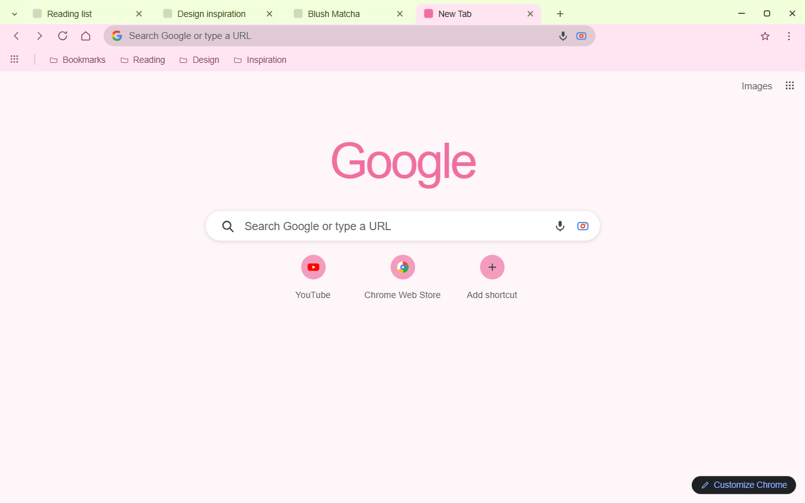
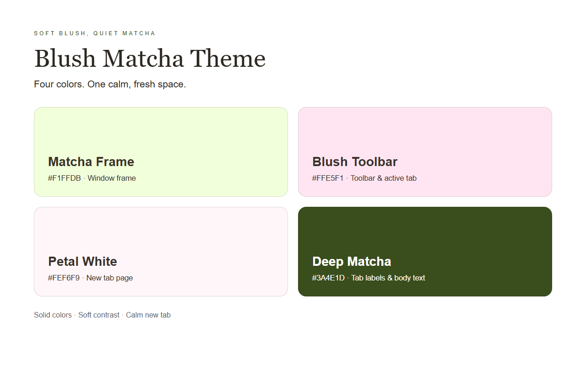
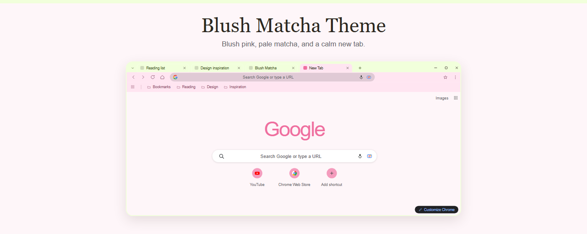
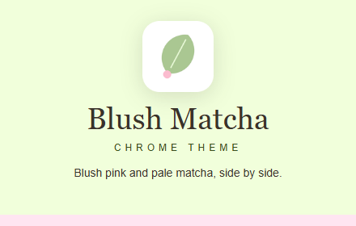

<p align="center">
  
</p>

<h1 align="center">Blush Matcha Theme</h1>

<p align="center">A calm Chrome theme in pale matcha green and blush pink, with a petal-white new tab.</p>

<p align="center">
  
  
</p>

## About

Blush Matcha Theme pairs a pale matcha window frame with a blush pink toolbar and a petal-white new tab page. Berry-toned text and icons keep tabs, bookmarks, and the address bar readable against the light surfaces.

Each layer is one flat, single solid color, so the window reads as a quiet, low-contrast space rather than a busy one. The palette lives entirely in the theme definition, and installing it recolors the browser chrome and the new tab page.

## Color Palette

| Token | Hex | Usage |
|-------|-----|-------|
| Matcha Frame | `#F1FFDB` | Window frame, tab strip, background tabs |
| Blush Toolbar | `#FFE5F1` | Toolbar, bookmarks bar, active tab |
| Petal White | `#FEF6F9` | New tab page background |
| Deep Matcha | `#3A4E1D` | Tab labels and body text |
| Berry Icon | `#793E58` | Toolbar icons |
| Berry Link | `#904C69` | Bookmarks bar and toolbar text |

Inactive window frames lighten to `#F5FFE5` so a background window stays visually one step behind the active one.

## Chrome UI Notes

Chrome paints a few parts of the window itself instead of reading them from the theme, so the store screenshots follow what a real install renders:

- **New tab Google mark:** Chrome computes a single flat color from the new tab background and lands on `#EF6F9F` here, rather than the four-color brand logo.
- **Shortcut tiles:** Chrome tints the round shortcut buttons from the new tab background, rendering them as `#F49CBD`.
- **Address bar:** the omnibox fill is blended against the themed toolbar by Chrome, which deepens it to `#E0CAD5`.
- **Window buttons:** the minimize, maximize, and close glyphs stay dark on the light frame.

## Features

- Pale matcha frame, blush pink toolbar, and petal-white new tab page.
- Deep matcha and berry text tuned for readable tabs, bookmarks, and address bar.
- Flat single-color surfaces on every layer, including the window frame and tab strip.
- A single-color Google mark on the new tab page, adapted to the palette.
- Theme-only package: Chrome applies it straight from the manifest, and the tab strip, toolbar, and new tab page follow along.

## Install

### From source (unpacked)

1. Download or clone this repository.
2. Open Chrome and go to `chrome://extensions`.
3. Turn on **Developer mode** in the top right corner.
4. Click **Load unpacked** and select this folder.

### From Chrome Web Store

Coming soon — the install link will be added here once the theme is published.

## Preview

**Browser interface** — the themed window with the bookmarks bar and a new tab page:



**Palette and surfaces** — the four theme colors with their roles:



**Marquee promo (1400x560):**



**Small promo (440x280):**



The screenshots and promo images are illustrative HTML/CSS layouts rendered by headless Chromium, calibrated against a real install of this theme.

## Files

| File | Description |
|------|-------------|
| `manifest.json` | Chrome theme manifest (MV3) with the inline `theme` config |
| `logo/logo128.png` | Theme icon (128x128), the only icon size a Chrome theme uses |
| `store-assets/screenshots/en/` | Store listing screenshots (1280x800) |
| `store-assets/promo/` | Small promo (440x280) and marquee promo (1400x560) |
| `store-assets/ASSET-NOTES.md` | Calibration notes for the store artwork |
| `store-assets/store-description.txt` | Store listing detailed description (English) |
| `scripts/generate_logo.py` | Draws the theme icon |
| `scripts/generate-store-assets.py` | Renders every store image from one HTML/CSS source |
| `scripts/package.py` | Builds the release ZIP |
| `PACKAGING.md` | What goes into the ZIP, and what stays out |

## Regenerate Assets

```bash
pip install -r scripts/requirements.txt
playwright install chromium
python scripts/generate_logo.py
python scripts/generate-store-assets.py
```

## Package

```bash
python scripts/package.py
```

The archive keeps `manifest.json` at its root and ships the theme body only; the store listing artwork is uploaded separately. See `PACKAGING.md`.

## License

Non-Commercial License — personal use permitted. Commercial use requires permission.
